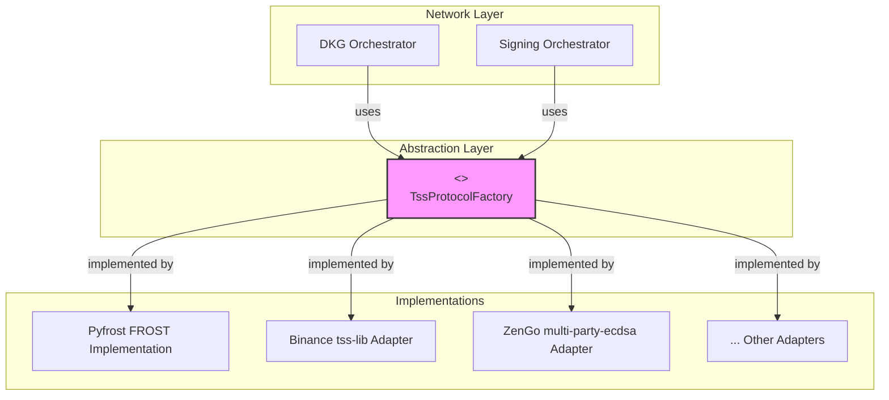

# Pyfrost Architecture

## Overview

The `pyfrost` library is designed with a modular architecture to support multiple Threshold Signature Scheme (TSS) implementations. This allows for flexibility in choosing the underlying cryptographic protocol without changing the core business logic of the application.

The architecture is divided into three main layers:
1.  **Network Layer**: Handles communication between nodes for DKG and signing ceremonies.
2.  **Abstraction Layer**: Defines a common interface for all TSS protocols.
3.  **Implementation Layer**: Contains the concrete implementations of the TSS protocols.

## Architecture Diagram



## Layers

### 1. Network Layer

This layer is responsible for orchestrating the multi-party computations. Key components include:
-   `DkgOrchestrator` ([`pyfrost/network/dkg.py`](./pyfrost/network/dkg.py:1)): Manages the process of distributed key generation. It takes a `protocol_type` as input and uses the corresponding factory to create the DKG instance.
-   API Routes ([`pyfrost/network/routes/`](./pyfrost/network/routes/)): The Flask blueprints that expose the DKG and signing functionality over HTTP. They are responsible for receiving requests, validating them, and initiating the TSS ceremonies.

### 2. Abstraction Layer

This layer, defined in [`pyfrost/tss/abstract.py`](./pyfrost/tss/abstract.py:1), provides the common interfaces that all TSS implementations must adhere to.
-   `DkgABC`: Abstract base class for the DKG process.
-   `SigningABC`: Abstract base class for the signing process.
-   `TssProtocolFactory`: An abstract factory for creating DKG and Signing instances.

### 3. Implementation Layer

This layer contains the concrete implementations of the TSS protocols. Each implementation is a "plugin" that conforms to the interfaces defined in the abstraction layer.
-   **Pyfrost FROST** ([`pyfrost/tss/pyfrost_frost.py`](./pyfrost/tss/pyfrost_frost.py:1)): The native FROST implementation.
-   **Binance TSS Adapter** ([`pyfrost/tss/binance_tss.py`](./pyfrost/tss/binance_tss.py:1)): An adapter for the `Binance tss-lib` (currently a stub).

## Adding a New TSS Protocol

To add support for a new TSS library (e.g., "MyTssLib"), you need to:

1.  **Create a new implementation file**: `pyfrost/tss/my_tss_lib.py`.
2.  **Implement the DKG and Signing classes**:
    -   Create `MyTssLibDkg(DkgABC)` and implement its `round1`, `round2`, `round3` methods. This will likely involve calling the external library via a CLI wrapper or C-bindings.
    -   Create `MyTssLibSigning(SigningABC)` and implement its `sign` method.
3.  **Create a factory**:
    -   Create `MyTssLibFactory(TssProtocolFactory)` that creates instances of your new DKG and Signing classes.
4.  **Register the new protocol**:
    -   Add your new factory to the `SUPPORTED_PROTOCOLS` dictionary in [`pyfrost/network/dkg.py`](./pyfrost/network/dkg.py:1).

```python
# in pyfrost/network/dkg.py
from ..tss.my_tss_lib import MyTssLibFactory

SUPPORTED_PROTOCOLS = {
    "pyfrost": PyfrostFROSTFactory,
    "binance": BinanceTssFactory,
    "mytsslib": MyTssLibFactory, # Add the new factory here
}
```

By following this pattern, the rest of the application (network layer, API endpoints) will automatically support the new protocol without any further changes.